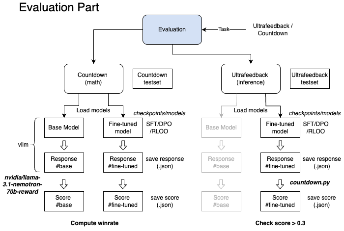

# **QWEN\_FINETUNE**
---


### checkpoints/

- The `initial/` inital model as start point and reference
- `sft/, dpo/, rloo/` for intermediate checkpoints for each training stage
- `final` the fully fine-tuned weights

---

### data/

Dataset for fine-tuning.

```
data/
└── smoltalk/          # Supervised fine-tuning (SFT) pairs
└── ultrafeedback/     # RLHF sets → DPO/RLOO
└── WarmStart Dataset  # Supervised fine-tuning (SFT) for question-answers
└── Countdown_dataset  # TinyZero sets → Need Rule-Based Reward Function (DPO/RLOO)
```

**For training:**
- Preference Datasets:
    - smoltalk
    - ultrafeedback (training split)
- Verifier-Based Datasets: 
    - Warmstart
    - Countdown (training split)

**For evaluation:**
- Evaluating Ultrafeedback (test set)
- Evaluating Countdown (test set)

**Insights**

...

---


### Model

Define the model -- Qwen 2.5 0.5B

Key helpers

```python
def load_tokenizer(model_name, trust_remote_code=True):
    ...

def load_model(model_name, quant=None, lora_cfg=None):
    ...

def save_model(model, save_dir):
    ...
```

---
### Tokenizer

Special tokens:
```
151644: <|im_start|>

151645: <|im_end|>

151643: <|endoftext|> (Padding)

198: \n
```

Example messages:
```
<|im_start|>system\nYou are a helpful assistant.<|im_end|>\n

<|im_start|>user\nPrompt text<|im_end|>\n

<|im_start|>assistant\nResponse text<|im_end|>
```

Masking Strategy:
```
labels[:len(prompt_ids)] = -100      # Ignore the prompt part in labels

labels[attention_mask == 0] = -100   # Ensure padding tokens are ignored
```

---
### Evaluation
```
evaluation.py
```


**outputs/** - to record the evaluation responses

**Generated inference** used for offline analysis.

---

### scripts/

| Script                  | What it does                                                                |
| ----------------------- | --------------------------------------------------------------------------- |
| `save_vanilla_model.py` | Utility to save the untouched base model into *checkpoints/initial/*.       |
| `data_download.py`      | Fetch and version datasets; pushes to *data/* in correct layout.            |
| `dataloader.py`         | Builds `torch.utils.data.Dataset` / `Dataset` objects from raw files.       |
| `train_model.py`        | Main training loop; picks config, stage (SFT, DPO, RLOO), handles resume.   |
| `evaluation.py`         | Runs automated eval; writes to *outputs/*.                                  |

---

### enviroment.txt