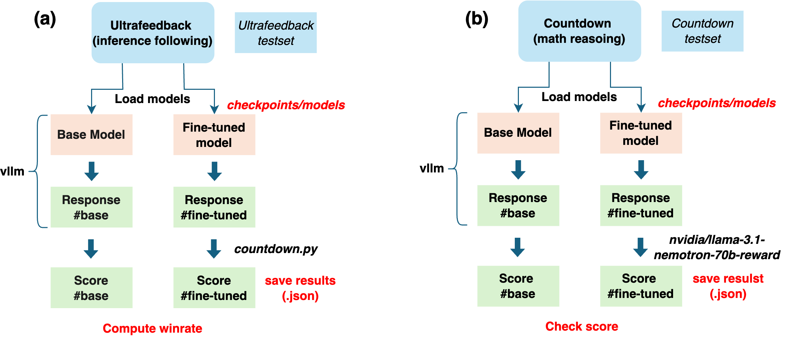

# **Fine-tune Qwen for Two Tasks**
---
The model used is Qwen 2.5 0.5B Base which is a small language model pretrained by the Qwen team, available from huggingface (https://huggingface.co/Qwen/Qwen2.5-0.5B). The basic sturcture of Qwen model is shown as,


 Two distinct tasks are **(1) instruction following** and **(2) math reasoning**.

### Experimental Setup

We have performed two supervised fine-tuning runs for the Qwen 2.5-0.5B baseline model on a single NVIDIA A100 GPU: a LoRA run for instruction following task on the SmolTalk corpus (learning-rate 5e-6, 3 epochs, $\approx$11 h) and a full-parameter run for math reasoning on the Countdown Warmstart data (same learning rate, 5 epochs, $\approx$10 min). Evaluation procedure used vLLM for generation and was performed on 200 randomly selected SmolTalk test samples, and 1000 randomly sampled Countdown-Tasks-3to4 problems. These two cases are then scored with the Llama 3.1 Nemotron-70B reward model and an exact-match countdown.py script, respectively.

--- 

### checkpoints/

- The `initial/` inital model as start point and reference
- `SFT/, DPO/, RLOO/` for intermediate checkpoints of each training stage and the name of dataset used such as `SFT_WarmStart`.

---

### data/

Dataset for fine-tuning.

```
data/
└── smoltalk/          # Supervised fine-tuning (SFT) pairs
└── ultrafeedback/     # RLHF sets → DPO/RLOO
└── WarmStart Dataset  # Supervised fine-tuning (SFT) for question-answers
└── Countdown_dataset  # TinyZero sets without → Need Rule-Based Reward Function (DPO/RLOO)
```
Data downloaded from Hugging Face Hub
-- Instrcution Following Dataset --
(1) SmolTalk (Dataset for SFT): https://huggingface.co/datasets/HuggingFaceTB/smol-smoltalk
(2) UltraFeedback (Dataset for DPO and RLOO): https://huggingface.co/datasets/HuggingFaceH4/ultrafeedback_binarized
-- Verifier-Based Dataset --
(3) WarmStart (Dataset for SFT): https://huggingface.co/datasets/Asap7772/cog_behav_all_strategies
(4) PromptsDataset from TinyZero (RLOO): https://huggingface.co/datasets/Jiayi-Pan/Countdown-Tasks-3to4
(5) On-Policy Preference Dataset (the same as PromptsDataset, DPO): https://huggingface.co/datasets/Jiayi-Pan/Countdown-Tasks-3to4

**For training:**
- Preference Datasets:
    - smoltalk
    - ultrafeedback (training split)
- Verifier-Based Datasets: 
    - Warmstart
    - Countdown (training split)
    - Sythetic data (using GPT-4o)

**For evaluation:**
- Evaluating Ultrafeedback (test set)
- Evaluating Countdown (test set)

---

### Model

Define the model -- Qwen 2.5 0.5B
```
models/qwen_model.py
```

Key helpers

```python
def load_tokenizer(model_name, trust_remote_code=True):
    ...

def load_model(model_name, quant=None, lora_cfg=None):
    ...

def save_model(model, save_dir):
    ...
```

**Reward models for RLOO**,
(1) DistilBERT model training
```
models/reward_DistilBERT_one.py
```
(2) Siamese-DistilBERT
```
models/reward_DistilBERT_sia.py
```

---
### Tokenizer

Load tokenizer:
```
model_path = "..."
# Load tokenizer
tokenizer = AutoTokenizer.from_pretrained(model_path, trust_remote_code=True)
tokenizer.pad_token = tokenizer.eos_token
```

Special tokens:
```
151644: <|im_start|>

151645: <|im_end|>

151643: <|endoftext|> (Padding)

198: \n
```

Example messages:
```
<|im_start|>system\nYou are a helpful assistant.<|im_end|>\n

<|im_start|>user\nPrompt text<|im_end|>\n

<|im_start|>assistant\nResponse text<|im_end|>
```

Masking Strategy:
```
labels[:len(prompt_ids)] = -100      # Ignore the prompt part in labels

labels[attention_mask == 0] = -100   # Ensure padding tokens are ignored
```

In the ```scripts/dataloader.py```

---
### Evaluation

```scripts/evaluation.py``` or ```scripts/eval_leaderboard.py```


```functions/countdown.py``` for the evaluation of math reasoning results for 0 for 0.1 for correct format, and 1.0 for correct answer.

**outputs/** - to record the evaluation responses for evaluation and further analysis.

---

### scripts/

| Script                  | What it does                                                                |
| ----------------------- | --------------------------------------------------------------------------- |
| `save_vanilla_model.py` | Utility to save the untouched base model into *checkpoints/initial/*.       |
| `merge_model.py` | To merge LoRA fine-tuned parameters with the original model.       |
| `data_download.py`      | Fetch and version datasets; pushes to *data/* in correct layout.            |
| `dataloader.py`         | Builds `torch.utils.data.Dataset` / `Dataset` objects from raw files.       |
| `(SFT/DPO)_train_(math/text)_(/lora).py`        | Main training loop; with config, stage (SFT, DPO), handles resume.   |
| `RLOO_train_text_(/oneBERT/sBERT).py`        | RLOO training loop; handles resume.   |
| `SFT_train_math_(after_text/syn_data).py`    | Training loop for math using a model fine-tuned on text data/using synthetic data.   |
| `evaluation.py`         | Runs automated evaluation; writes to *outputs/*.                                  |
| `eval_leaderboard.py`         | Runs another evaluation create datasets for leaderboard. |

---

### enviroment.txt
The module needed are listed here.

### README.md
This file.